# Architecture Diagram Options for Pantry Pirate Radio

## Option 1: Current Top-Down Flow with Custom Theme

```mermaid
%%{init: {'theme':'base', 'themeVariables': { 'primaryColor':'#1976d2', 'primaryTextColor':'#fff', 'primaryBorderColor':'#0d47a1', 'lineColor':'#424242', 'secondaryColor':'#ff6f00', 'tertiaryColor':'#4a148c', 'background':'#fafafa', 'mainBkg':'#e3f2fd', 'secondBkg':'#fff3e0', 'tertiaryBkg':'#f3e5f5'}}}%%
flowchart TB
    %% Data Collection Layer
    Scrapers[Scrapers<br/>12+ sources] --> |submits jobs| RedisQueue[Redis Queue<br/>Job Queue]
    
    %% Content Store checks happen during job submission
    Scrapers --> |checks dedup| ContentStore[Content Store<br/>Deduplication]
    ContentStore --> |if new content| RedisQueue
    ContentStore --> |if duplicate| SkipLLM[Skip LLM<br/>Return existing job]
    
    %% LLM Processing Layer
    RedisQueue --> LLMWorkers[LLM Workers<br/>Scalable]
    LLMWorkers --> LLM[LLM Providers<br/>OpenAI/Claude]
    LLM --> |HSDS aligned data| LLMWorkers
    
    %% LLM Workers create new jobs
    LLMWorkers --> |creates reconciler job| ReconcilerQueue[Reconciler Jobs]
    LLMWorkers --> |creates recorder job| RecorderQueue[Recorder Jobs]
    
    %% Update Content Store after processing
    LLMWorkers --> |marks complete| ContentStore
    
    %% Reconciler Processing
    ReconcilerQueue --> Reconciler[Reconciler Service<br/>• Location matching<br/>• Entity deduplication<br/>• Version tracking]
    
    %% Recorder Processing
    RecorderQueue --> Recorder[Recorder Service<br/>• Archive JSON data]
    
    %% Storage Layer
    Reconciler --> PostgreSQL[(PostgreSQL +<br/>PostGIS<br/>HSDS Database)]
    Recorder --> OutputsFolder[outputs/<br/>JSON Files]
    
    %% API Layer
    PostgreSQL --> FastAPI[FastAPI<br/>Server]
    
    %% Publishing Layer
    OutputsFolder --> |reads JSON files| Publisher[HAARRRvest Publisher<br/>• Builds location map data<br/>• Exports DB to SQLite<br/>• Syncs content store]
    PostgreSQL --> |exports to SQLite| Publisher
    ContentStore -.-> |syncs for backup| Publisher
    
    Publisher --> HAARRRvest[HAARRRvest<br/>Repository]
    
    %% Style
    classDef service fill:#e1f5fe,stroke:#01579b,stroke-width:2px
    classDef storage fill:#fff3e0,stroke:#e65100,stroke-width:2px
    classDef external fill:#f3e5f5,stroke:#4a148c,stroke-width:2px
    classDef queue fill:#e8f5e9,stroke:#1b5e20,stroke-width:2px
    
    class Scrapers,LLMWorkers,Reconciler,Recorder,FastAPI,Publisher service
    class ContentStore,PostgreSQL,OutputsFolder storage
    class LLM,HAARRRvest external
    class RedisQueue,ReconcilerQueue,RecorderQueue,SkipLLM queue
```

## Option 2: Left-to-Right Flow

## Option 3: With Subgraphs for Clarity

## Option 4: Simplified Overview

```mermaid
graph TD
    Scrapers[🕷️ Scrapers] --> Dedup{Deduplication}
    Dedup -->|New| Process[🤖 LLM Processing]
    Dedup -->|Exists| Done[✅ Return Result]
    
    Process --> Match[🔍 Location Matching]
    Process --> Save[💾 Save JSON]
    
    Match --> DB[(🗄️ Database)]
    Save --> Files[📁 JSON Files]
    
    DB --> API[🌐 API]
    Files --> Publish[📤 Publish]
    DB --> Publish
    
    Publish --> Github[📚 GitHub Repository]
```

## Option 5: Dark Theme

## Option 6: Process State Diagram

## Option 7: Sequence Diagram for Job Flow

## Recommendations

1. **For README**: Use Option 1 (current) or Option 3 (with subgraphs) for clarity
2. **For Architecture Docs**: Use Option 7 (sequence diagram) to show detailed flow
3. **For Presentations**: Use Option 4 (simplified overview) for non-technical audiences
4. **For Developer Docs**: Use Option 2 (left-to-right) as it follows reading direction

### Customization Tips
- Change `TB` to `LR` for horizontal layout
- Adjust colors in `themeVariables` to match your brand
- Use emoji in node labels for visual appeal
- Add `click NodeName "URL"` to make nodes clickable in supported viewers
- Use subgraphs to group related components