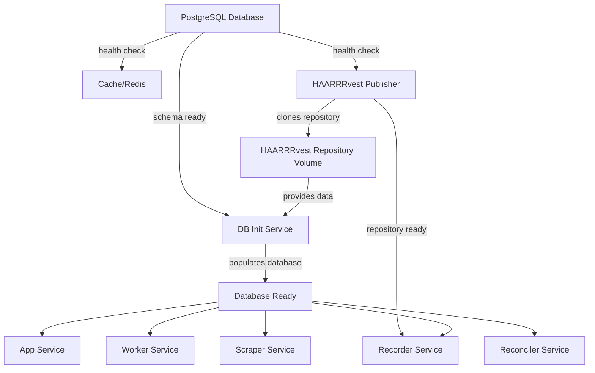

# Docker Startup Sequence Documentation

## Overview

Pantry Pirate Radio uses a carefully orchestrated startup sequence to ensure all services start in the correct order with proper data initialization. The system uses a unified Docker image architecture where all Python services share the same base image, differentiated by the `SERVICE_TYPE` environment variable or command arguments.

## Service Dependencies

### Startup Flow Diagram



## Startup Modes

### 1. Quick Start (Empty Database)

For development or when you don't need pre-populated data:

```bash
# Using bouy (recommended)
./bouy up                    # Development mode (default)
./bouy up --dev             # Explicit development mode
./bouy up --prod            # Production mode
./bouy up --test            # Test mode
```

**What happens:**
1. PostgreSQL starts and initializes with HSDS schema
2. Redis cache starts
3. HAARRRvest publisher starts and clones the repository
4. All other services start immediately
5. Database has schema but no data

**Use when:**
- Running tests
- Development work that doesn't need real data
- CI/CD pipelines
- First time setup before running scrapers

### 2. Full Start with Data Population (Recommended)

For production-like environment with real data:

```bash
# Using bouy (handles all complexity automatically)
./bouy up --with-init        # Development mode with data population
./bouy up --dev --with-init  # Explicit dev mode with data
./bouy up --prod --with-init # Production mode with data
```

**Note**: The bouy script automatically manages the correct compose files and profiles. It merges `.docker/compose/base.yml` with the appropriate overlay files and sets the `--profile with-init` flag when needed.

**What happens:**
1. PostgreSQL starts and initializes with HSDS schema
2. Redis cache starts
3. HAARRRvest publisher starts and clones the repository
4. DB-init service waits for repository to be ready
5. DB-init runs replay utility to populate ~90 days of data
6. All other services wait for DB-init to complete
7. Services start with fully populated database

**Use when:**
- Setting up local development environment
- Testing with real data
- Demonstrating the system
- Production deployments

## Service Details

### Unified Image Architecture
All Python services use a single Docker image (`pantry-pirate-radio:latest`) built from `.docker/images/app/Dockerfile`. The service type is determined by:
1. The `command` field in docker-compose configuration
2. The `SERVICE_TYPE` environment variable
3. Command-line arguments passed to the entrypoint

The entrypoint script (`/scripts/docker-entrypoint.sh`) routes to the appropriate service.

### Database (db)
- **Image**: postgis/postgis:15-3.3
- **Health Check**: Uses `pg_isready -U ${POSTGRES_USER} -d ${POSTGRES_DB}`
- **Initialization**: Runs SQL scripts from `init-scripts/` directory
- **Data**: Persisted in `postgres_data` volume
- **Ports**: 5432 (PostgreSQL standard)

### HAARRRvest Publisher (haarrrvest-publisher)
- **Image**: Uses unified `pantry-pirate-radio:latest` image
- **Command**: `["publisher"]` - routed through docker-entrypoint.sh
- **Purpose**: Manages HAARRRvest repository and publishes new data
- **Startup**: Clones repository on first run, pulls updates on subsequent runs
- **Health Check**: `/app/scripts/check-haarrrvest-repo.sh` - verifies repository exists
- **Volume**: `haarrrvest_repo` shared with other services at `/data-repo`
- **Environment**:
  - `DATA_REPO_URL`: Repository URL (default: HAARRRvest GitHub)
  - `PUBLISHER_PUSH_ENABLED`: Must be 'true' to push (default: false)
  - `DATA_REPO_PATH`: `/data-repo`

### Database Initializer (db-init)
- **Image**: Uses unified `pantry-pirate-radio:latest` image
- **Command**: `["db-init"]` - runs `/app/scripts/init-database.sh`
- **Purpose**: Populates database with SQL dumps from HAARRRvest
- **Profile**: Only runs when `--profile with-init` is specified
- **Process**:
  1. Waits for PostgreSQL to be healthy
  2. Waits for HAARRRvest repository to be ready
  3. Checks for SQL dumps in `/data-repo/sql_dumps/`
  4. Restores latest SQL dump if available (<5 minutes)
  5. Falls back to empty database if no dumps found
- **Health Check**: `/app/scripts/wait-for-db-ready.sh init`
- **Environment**:
  - `DB_INIT_DAYS_TO_SYNC`: Days of data to sync (default: 90)
  - `SKIP_DB_INIT`: Skip initialization if 'true'
  - `REPO_STABILITY_CHECK_INTERVAL`: Seconds between checks (default: 10)
  - `REPO_MAX_WAIT_TIME`: Max wait time in seconds (default: 1800)

### Application Services (All use unified image)

#### App (FastAPI Server)
- **Command**: `["app"]` - starts Uvicorn on port 8000
- **Volumes**: `/app/outputs`, `/data-repo`, `/app/data`, Claude config
- **Dependencies**: db (healthy), cache (started)
- **Ports**: 8000 (FastAPI)

#### Worker (LLM Processing)
- **Command**: `["worker"]` - starts RQ worker(s)
- **Environment**:
  - `WORKER_COUNT`: Number of workers per container (default: 1, max: 20)
  - `QUEUE_NAME`: Queue to process (default: llm)
  - `CLAUDE_HEALTH_SERVER`: Enable health endpoint if 'true'
- **Multi-Worker Support**: Uses `/app/scripts/multi_worker.sh` when WORKER_COUNT > 1
- **Claude Integration**: Uses `/app/scripts/claude_worker.py` for LLM queue
- **Ports**: 8080-8089 (health check endpoints for scaling)

#### Recorder
- **Command**: `["recorder"]` - archives job results
- **Dependencies**: db, cache, haarrrvest-publisher (healthy)
- **Volumes**: Includes `/app/archives` for backups

#### Scraper
- **Command**: `["scraper"]` - data collection
- **Playwright Support**: Chromium browser installed for web scraping
- **Dependencies**: db (healthy), cache (started)

#### Reconciler
- **Command**: `["reconciler"]` - data processing and consistency
- **Dependencies**: db (healthy), cache (started)

### Supporting Services

#### Cache (Redis)
- **Image**: redis:7-alpine
- **Port**: 6379
- **Volume**: `redis_data`

#### RQ Dashboard
- **Image**: Uses unified image with `["rq-dashboard"]` command
- **Port**: 9181
- **Purpose**: Job queue monitoring

#### Content Store Dashboard
- **Image**: Uses unified image with `["dashboard"]` command
- **Port**: 5050
- **Environment**: `DASHBOARD_HOST=0.0.0.0`

#### Datasette (Data Viewer)
- **Image**: Custom build from `.docker/images/datasette/Dockerfile`
- **Port**: 8001
- **Purpose**: Interactive SQLite database viewer
- **Waits for**: HAARRRvest publisher to create SQLite database


## Configuration

### Environment Variables

```bash
# Project Configuration
COMPOSE_PROJECT_NAME=pantry-pirate-radio  # Consistent network naming

# Database
POSTGRES_USER=postgres
POSTGRES_PASSWORD=pirate                  # Default, change in production
POSTGRES_DB=pantry_pirate_radio
DATABASE_URL=postgresql+asyncpg://postgres:pirate@db:5432/pantry_pirate_radio

# Redis Cache
REDIS_URL=redis://cache:6379/0

# Database initialization
DB_INIT_DAYS_TO_SYNC=90                   # Number of days of data to load
SKIP_DB_INIT=false                        # Skip data population
REPO_STABILITY_CHECK_INTERVAL=10          # Seconds between repo checks
REPO_STABILITY_THRESHOLD=3                # Consecutive stable checks required
REPO_MAX_WAIT_TIME=1800                   # Max wait time (30 minutes)

# HAARRRvest repository
DATA_REPO_URL=https://github.com/For-The-Greater-Good/HAARRRvest.git
DATA_REPO_TOKEN=your_token                # For private repos or pushing
DATA_REPO_PATH=/data-repo                 # Mount point in containers

# Publishing safety
PUBLISHER_PUSH_ENABLED=false              # MUST be 'true' to push (default: false)

# Worker Configuration
WORKER_COUNT=1                            # Workers per container (1-20)
QUEUE_NAME=llm                           # Queue for workers to process
CLAUDE_HEALTH_SERVER=true                # Enable health endpoint

# LLM Provider
LLM_PROVIDER=claude                       # 'claude' or 'openai'
ANTHROPIC_API_KEY=your_key               # For Claude API
OPENROUTER_API_KEY=your_key              # For OpenAI via OpenRouter
```

⚠️ **Push Safety**: The HAARRRvest publisher runs in read-only mode by default. Set `PUBLISHER_PUSH_ENABLED=true` ONLY for production instances that should push data.

### Health Checks

All critical services include health checks:

```yaml
healthcheck:
  test: ["CMD", "command"]
  interval: 10s      # How often to check
  timeout: 5s        # Timeout for each check
  retries: 30        # Number of retries before unhealthy
  start_period: 60s  # Grace period before first check
```

## Monitoring Startup

### View Service Status
```bash
# Using bouy (recommended)
./bouy ps                    # List all services
./bouy --json ps            # JSON output for automation
```

### Monitor Initialization Progress
```bash
# Watch all services starting
./bouy logs                  # Follow all logs
./bouy logs app             # Follow specific service
./bouy logs db-init         # Monitor database initialization
./bouy logs haarrrvest-publisher  # Check repository status

# Check multiple services
./bouy logs app worker

# Non-following mode for scripts
./bouy --programmatic logs app
```

### Check Health Status
```bash
# Check if services are healthy
./bouy ps | grep healthy

# Manually run health checks
./bouy exec haarrrvest-publisher /app/scripts/check-haarrrvest-repo.sh
./bouy exec db-init /app/scripts/wait-for-db-ready.sh init
./bouy exec db pg_isready

# Check worker health endpoint (if enabled)
curl http://localhost:8080/health
```

## Troubleshooting

### Services Not Starting

1. **Check dependencies**: Ensure required services are healthy
   ```bash
   ./bouy ps
   ```

2. **View logs**: Look for error messages
   ```bash
   ./bouy logs service-name
   ./bouy --verbose up  # Verbose mode for debugging
   ```

3. **Verify repository**: Check if HAARRRvest cloned successfully
   ```bash
   ./bouy exec haarrrvest-publisher ls -la /data-repo
   ./bouy exec haarrrvest-publisher git -C /data-repo status
   ```

4. **Check unified image**: Verify the image built correctly
   ```bash
   docker images | grep pantry-pirate-radio
   ./bouy build app  # Rebuild if needed
   ```

### Slow Initialization

- **SQL Dump Restore**: <5 minutes for full database (preferred method)
- **Empty Database**: Instant if no SQL dumps available
- Monitor progress: `./bouy logs -f db-init`
- Health check configuration:
  - `start_period`: 600s (10-minute grace period)
  - `interval`: 30s between checks
  - `timeout`: 10s per check
  - `retries`: 100 attempts before marking unhealthy

### Repository Clone Failures

- Check network connectivity
- Verify `DATA_REPO_URL` is correct
- For private repos, ensure `DATA_REPO_TOKEN` is set
- Check disk space for volume storage

### Restarting After Failure

```bash
# Stop everything
./bouy down

# Remove volumes for clean start
./bouy clean  # Stops services and removes volumes

# Start again with initialization
./bouy up --with-init

# Or start fresh without data
./bouy up
```

## CI/CD Considerations

For CI environments:

```bash
# Use programmatic mode for clean output
./bouy --programmatic --quiet up
./bouy --programmatic --quiet test
./bouy --json ps  # Get status as JSON

# Skip data initialization
export CI=true
./bouy up  # Will skip db-init automatically

# Or explicitly skip
export SKIP_DB_INIT=true
./bouy up --with-init  # db-init will exit immediately
```

## Best Practices

1. **First Time Setup**: 
   ```bash
   ./bouy setup         # Interactive configuration wizard
   ./bouy up --with-init  # Start with populated database
   ```

2. **Daily Development**: 
   ```bash
   ./bouy up            # Uses existing data
   ./bouy logs app      # Monitor specific services
   ```

3. **CI/CD**: 
   ```bash
   export CI=true
   ./bouy --programmatic --quiet up
   ./bouy --programmatic --quiet test
   ```

4. **Production**: 
   ```bash
   ./bouy up --prod --with-init  # Initial deployment
   ./bouy up --prod             # Subsequent starts
   ```

5. **Scaling Workers**:
   ```bash
   # Multiple workers in one container
   WORKER_COUNT=4 ./bouy up worker
   
   # Multiple containers (Docker Compose scaling)
   ./bouy up
   docker compose scale worker=3
   ```

## Deployment Safety

### Development Environments
```bash
# .env file should have:
PUBLISHER_PUSH_ENABLED=false  # Default - prevents accidental pushes
```

### Production Deployment
```bash
# .env.production should have:
PUBLISHER_PUSH_ENABLED=true   # Explicitly enable for production only
DATA_REPO_TOKEN=<production_token>
```

### Verification
Check the logs to confirm push status:
```bash
./bouy logs haarrrvest-publisher | grep -E "(PUSH ENABLED|READ-ONLY)"
```

You should see either:
- `✅ Publisher running in READ-ONLY mode - no remote pushes will occur` (dev)
- `⚠️  PUBLISHER PUSH ENABLED - This instance WILL push to remote repository!` (prod)

## Advanced Usage

### Custom Startup Sequence

The bouy script automatically handles compose file selection based on mode:
- Base: `.docker/compose/base.yml`
- Development: `+ docker-compose.dev.yml`
- Production: `+ docker-compose.prod.yml`
- Test: `+ docker-compose.test.yml`
- With Init: `+ docker-compose.with-init.yml`

For custom configurations, create an overlay file:
```yaml
# .docker/compose/docker-compose.custom.yml
services:
  app:
    environment:
      - CUSTOM_VAR=value
```

Then modify bouy or use docker compose directly:
```bash
docker compose -f .docker/compose/base.yml -f .docker/compose/docker-compose.custom.yml up -d
```

### Partial Startup

Start only specific services:
```bash
# Just database and cache
./bouy up db cache

# Add HAARRRvest publisher
./bouy up haarrrvest-publisher

# Start remaining services
./bouy up

# Start specific service with dependencies
./bouy up app  # Automatically starts db and cache too
```

## Docker Volumes

The system uses several named volumes for data persistence:

| Volume | Purpose | Used By |
|--------|---------|----------|
| `postgres_data` | PostgreSQL database files | db |
| `redis_data` | Redis cache persistence | cache |
| `haarrrvest_repo` | HAARRRvest git repository | All services (at `/data-repo`) |
| `app_data` | Shared application data | All Python services |
| `claude_config` | Claude CLI authentication | worker, all Python services |
| `vscode-server` | VSCode server extensions | app (dev mode only) |

## Network Architecture

All services communicate on the Docker network `pantry-pirate-radio_default`. Service discovery uses container names:
- Database: `db:5432`
- Cache: `cache:6379`
- API: `app:8000`
- Workers: `worker:8080-8089` (health endpoints)