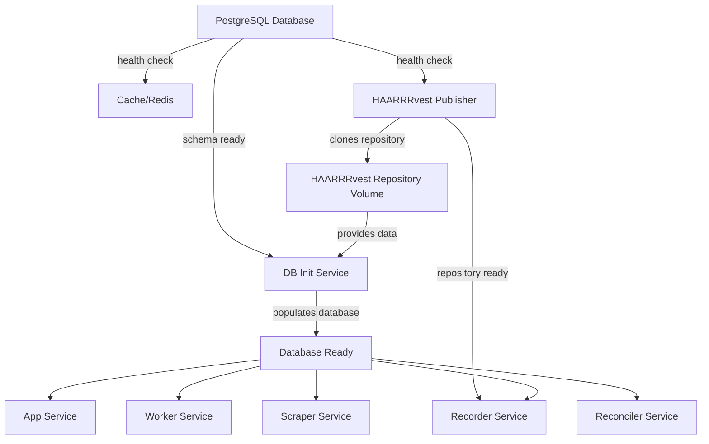

# Docker Startup Sequence Documentation

## Overview

Pantry Pirate Radio uses a carefully orchestrated startup sequence to ensure all services start in the correct order with proper data initialization. This document explains the startup process and configuration options.

## Service Dependencies

### Startup Flow Diagram



## Startup Modes

### 1. Quick Start (Empty Database)

For development or when you don't need pre-populated data:

```bash
docker compose up -d
```

**What happens:**
1. PostgreSQL starts and initializes with HSDS schema
2. Redis cache starts
3. HAARRRvest publisher starts and clones the repository
4. All other services start immediately
5. Database has schema but no data

**Use when:**
- Running tests
- Development work that doesn't need real data
- CI/CD pipelines
- First time setup before running scrapers

### 2. Full Start with Data Population (Recommended)

For production-like environment with real data:

```bash
docker compose -f docker-compose.yml -f docker-compose.with-init.yml --profile with-init up -d
```

**Important**: You must use both `-f` flags to merge the compose files AND the `--profile with-init` flag. The profile alone is not sufficient because the dependency overrides are in the `docker-compose.with-init.yml` file.

**What happens:**
1. PostgreSQL starts and initializes with HSDS schema
2. Redis cache starts
3. HAARRRvest publisher starts and clones the repository
4. DB-init service waits for repository to be ready
5. DB-init runs replay utility to populate ~90 days of data
6. All other services wait for DB-init to complete
7. Services start with fully populated database

**Use when:**
- Setting up local development environment
- Testing with real data
- Demonstrating the system
- Production deployments

## Service Details

### Database (db)
- **Image**: postgis/postgis:15-3.3
- **Health Check**: Uses `pg_isready` to verify database is accepting connections
- **Initialization**: Runs SQL scripts from `init-scripts/` directory
- **Data**: Persisted in `postgres_data` volume

### HAARRRvest Publisher (haarrrvest-publisher)
- **Purpose**: Manages HAARRRvest repository and publishes new data
- **Startup**: Clones repository on first run, pulls updates on subsequent runs
- **Health Check**: Verifies repository exists at `/data-repo/.git`
- **Volume**: `haarrrvest_repo` shared with other services

### Database Initializer (db-init)
- **Purpose**: Populates database with historical data from HAARRRvest
- **Profile**: Only runs when `--profile with-init` is specified
- **Process**:
  1. Waits for PostgreSQL to be healthy
  2. Waits for HAARRRvest repository to be cloned
  3. Runs replay utility on JSON files
  4. Marks itself as healthy when complete
- **Skip**: Set `SKIP_DB_INIT=true` or `CI=true` to skip data loading

### Other Services
- **App**: FastAPI server, waits for database
- **Worker**: LLM processing workers, wait for database
- **Recorder**: Saves job results, needs repository volume
- **Scraper**: Data collection, waits for database
- **Reconciler**: Data processing, waits for database

## Configuration

### Environment Variables

```bash
# Database initialization
DB_INIT_DAYS_TO_SYNC=90     # Number of days of data to load
SKIP_DB_INIT=false           # Skip data population
CI=true                      # Also skips data population

# HAARRRvest repository
DATA_REPO_URL=https://github.com/For-The-Greater-Good/HAARRRvest.git
DATA_REPO_TOKEN=your_token   # For private repos

# Publishing safety
PUBLISHER_PUSH_ENABLED=false # MUST be 'true' to push to remote (default: false)
```

⚠️ **Push Safety**: The HAARRRvest publisher runs in read-only mode by default. Set `PUBLISHER_PUSH_ENABLED=true` ONLY for production instances that should push data.

### Health Checks

All critical services include health checks:

```yaml
healthcheck:
  test: ["CMD", "command"]
  interval: 10s      # How often to check
  timeout: 5s        # Timeout for each check
  retries: 30        # Number of retries before unhealthy
  start_period: 60s  # Grace period before first check
```

## Monitoring Startup

### View Service Status
```bash
docker compose ps
```

### Monitor Initialization Progress
```bash
# Watch all services starting
docker compose logs -f

# Monitor specific service
docker compose logs -f db-init

# Check HAARRRvest repository clone
docker compose logs -f haarrrvest-publisher
```

### Check Health Status
```bash
# Check if services are healthy
docker compose ps | grep healthy

# Manually run health check
docker compose exec haarrrvest-publisher /app/scripts/check-haarrrvest-repo.sh
```

## Troubleshooting

### Services Not Starting

1. **Check dependencies**: Ensure required services are healthy
   ```bash
   docker compose ps
   ```

2. **View logs**: Look for error messages
   ```bash
   docker compose logs service-name
   ```

3. **Verify repository**: Check if HAARRRvest cloned successfully
   ```bash
   docker compose exec haarrrvest-publisher ls -la /data-repo
   ```

### Slow Initialization

- DB-init can take 5-15 minutes depending on data volume
- Monitor progress: `docker compose logs -f db-init`
- Reduce data: Set `DB_INIT_DAYS_TO_SYNC=7` for faster init

### Repository Clone Failures

- Check network connectivity
- Verify `DATA_REPO_URL` is correct
- For private repos, ensure `DATA_REPO_TOKEN` is set
- Check disk space for volume storage

### Restarting After Failure

```bash
# Stop everything
docker compose down

# Remove volumes if you need a clean start
docker compose down -v

# Start again with initialization
docker compose -f docker-compose.yml -f docker-compose.with-init.yml --profile with-init up -d
```

## CI/CD Considerations

For CI environments, always set `CI=true` to skip data population:

```yaml
environment:
  CI: true
```

Or use the standard docker compose without the profile:
```bash
docker compose up -d  # No --profile with-init
```

## Best Practices

1. **First Time Setup**: Use `--profile with-init` to get real data
2. **Daily Development**: Use normal startup (already has data)
3. **CI/CD**: Always skip data init with `CI=true`
4. **Production**: Use `--profile with-init` for initial deployment
5. **Updates**: Let HAARRRvest publisher handle incremental updates

## Deployment Safety

### Development Environments
```bash
# .env file should have:
PUBLISHER_PUSH_ENABLED=false  # Default - prevents accidental pushes
```

### Production Deployment
```bash
# .env.production should have:
PUBLISHER_PUSH_ENABLED=true   # Explicitly enable for production only
DATA_REPO_TOKEN=<production_token>
```

### Verification
Check the logs to confirm push status:
```bash
docker compose logs haarrrvest-publisher | grep -E "(PUSH ENABLED|READ-ONLY)"
```

You should see either:
- `✅ Publisher running in READ-ONLY mode - no remote pushes will occur` (dev)
- `⚠️  PUBLISHER PUSH ENABLED - This instance WILL push to remote repository!` (prod)

## Advanced Usage

### Custom Startup Sequence

Create your own override file:

```yaml
# docker-compose.custom.yml
services:
  app:
    depends_on:
      custom-service:
        condition: service_healthy
```

Run with:
```bash
docker compose -f docker-compose.yml -f docker-compose.custom.yml up -d
```

### Partial Startup

Start only specific services:
```bash
# Just database and cache
docker compose up -d db cache

# Add HAARRRvest publisher
docker compose up -d haarrrvest-publisher

# Then other services
docker compose up -d
```