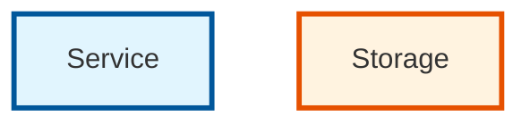
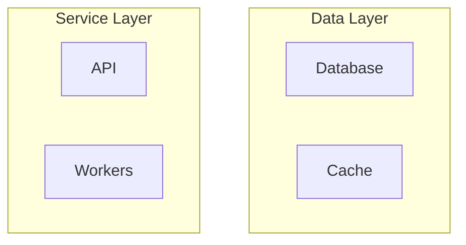
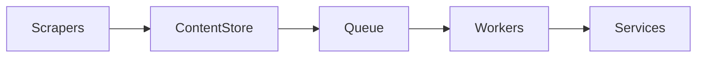
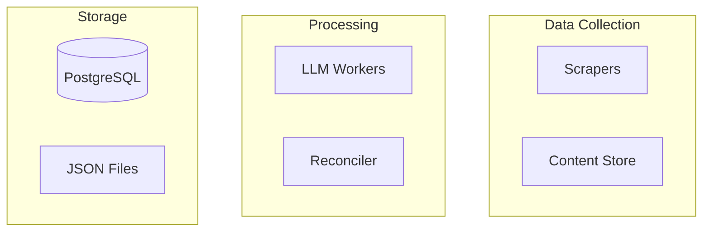
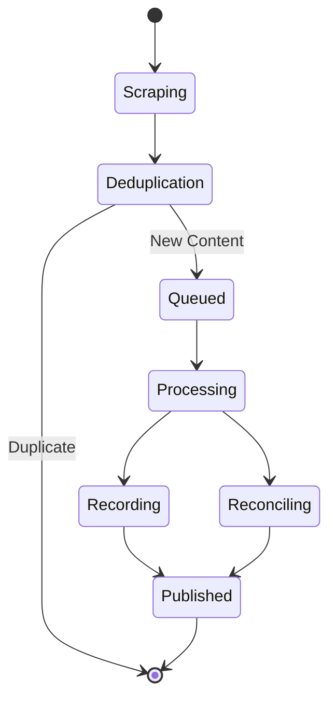
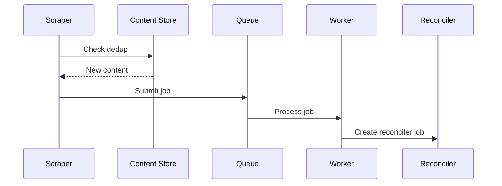

# Mermaid Diagram Rendering Options

## 1. Different Graph Types

### Flowchart with Different Directions
- `graph TD` or `flowchart TD` - Top Down
- `graph LR` or `flowchart LR` - Left to Right  
- `graph BT` or `flowchart BT` - Bottom to Top
- `graph RL` or `flowchart RL` - Right to Left

### Other Diagram Types
- `sequenceDiagram` - For showing sequential flows
- `stateDiagram-v2` - For state machines
- `erDiagram` - For entity relationships
- `gitGraph` - For git workflows

## 2. Themes

### Built-in Themes
```mermaid
%%{init: {'theme':'default'}}%%
```
- `default` - Standard blue theme
- `neutral` - Gray theme
- `dark` - Dark mode theme
- `forest` - Green theme
- `base` - Customizable base theme

## 3. Custom Styling

### Using themeVariables
```mermaid
%%{init: {'theme':'base', 'themeVariables': {
  'primaryColor':'#ff0000',
  'primaryTextColor':'#fff',
  'primaryBorderColor':'#7C0000',
  'lineColor':'#000000',
  'secondaryColor':'#006100',
  'tertiaryColor':'#fff',
  'background':'#f4f4f4'
}}}%%
```

### Using CSS Classes


## 4. Node Shapes

- `A[Rectangle]` - Default rectangle
- `A(Rounded Rectangle)` - Rounded corners
- `A{Diamond}` - Decision shape
- `A((Circle))` - Circle shape
- `A>Asymmetric]` - Tag shape
- `A{{Hexagon}}` - Hexagon shape
- `A[/Parallelogram/]` - Parallelogram
- `A[\Parallelogram\]` - Inverted parallelogram
- `A[/Trapezoid\]` - Trapezoid
- `A[\Trapezoid/]` - Inverted trapezoid
- `A(((Double Circle)))` - Double circle

## 5. Line Types

- `A --> B` - Solid arrow
- `A --- B` - Solid line
- `A -.-> B` - Dotted arrow
- `A -.- B` - Dotted line
- `A ==> B` - Thick arrow
- `A === B` - Thick line

## 6. Subgraphs



## Examples for Our Architecture

### Option 1: Left-to-Right Flow


### Option 2: With Subgraphs


### Option 3: State Diagram


### Option 4: Sequence Diagram
